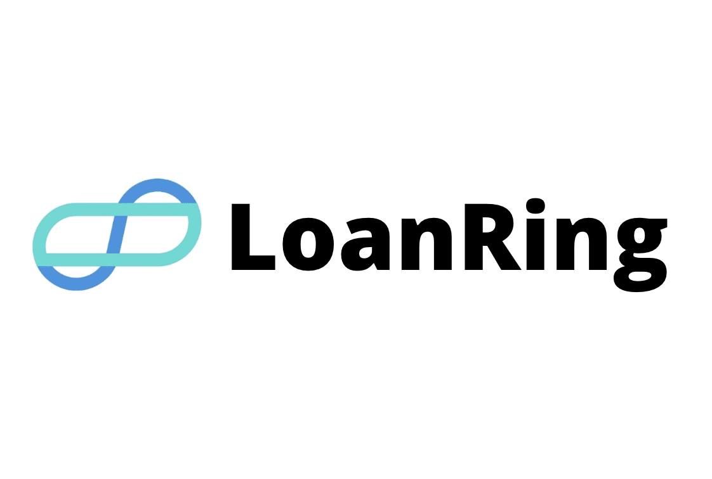
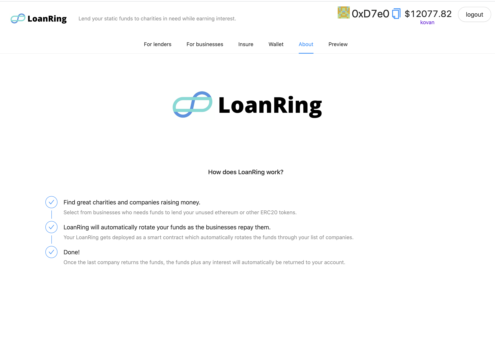
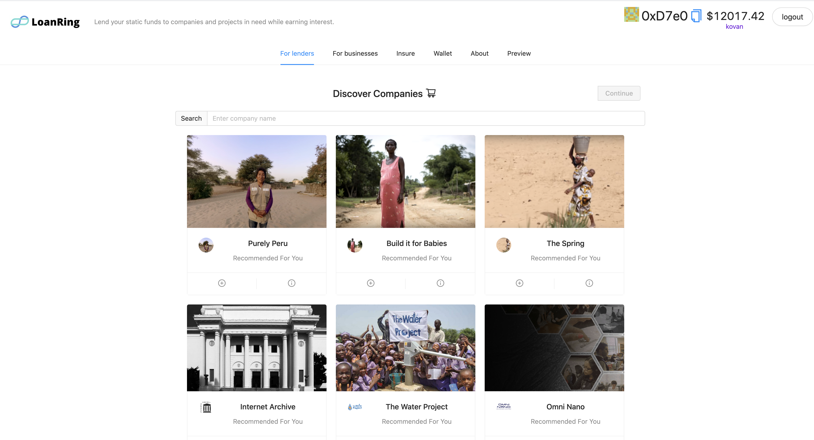
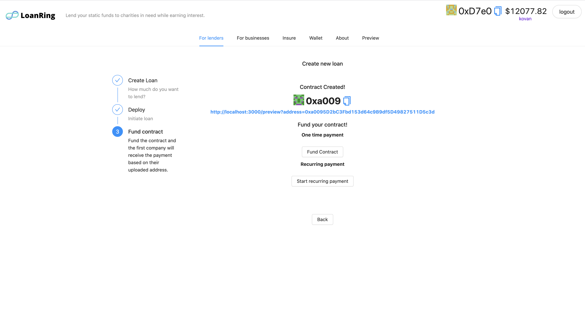
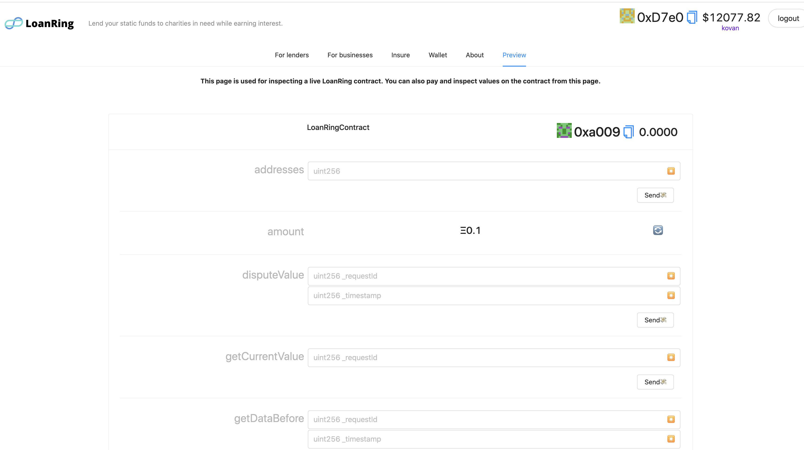
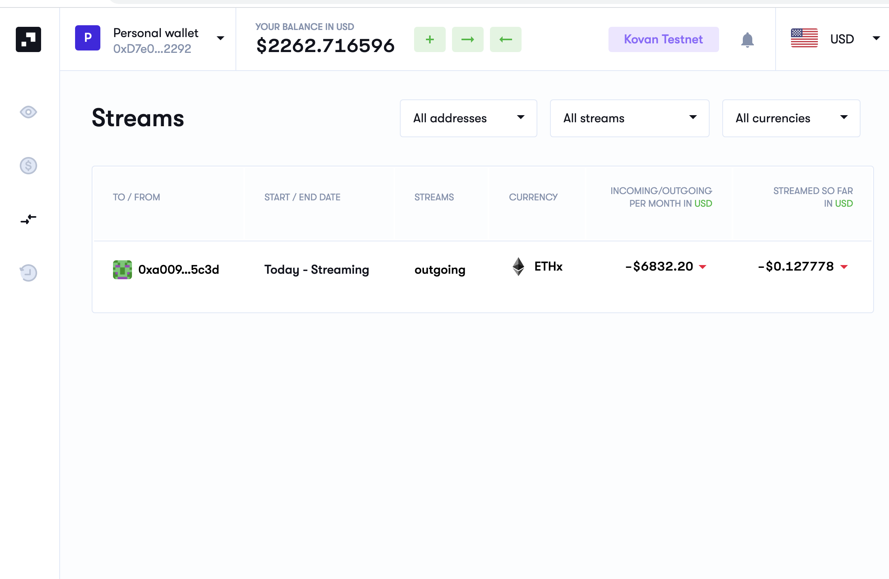
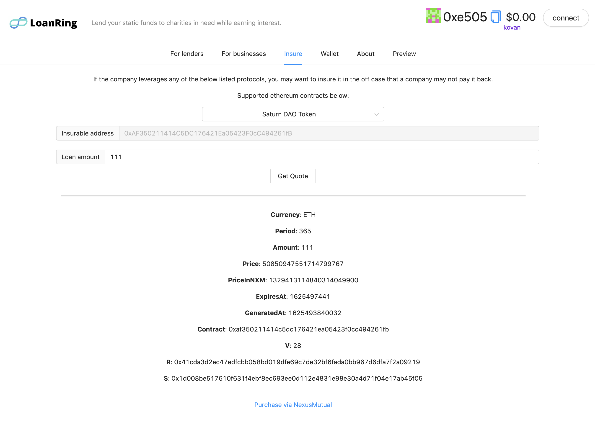

    

## LoanRing

LoanRing is an application that increases the utility of static cryptocurrency by offering automated loans to businesses.

Built for hack.money 2021.

### Inspiration

More than 1.7 billion people around the world are unbanked and can’t access the financial services they need. LoanRing aims to address this by allowing any lender with tools to offer resources to those that need them the most. Maximize the impact of a loan by automatically relending funds once they are repaid. With crowd sourced loans, students can pay for tuition, women can start businesses, farmers are able to invest in equipment and families can afford needed emergency care. With all transactions taking place on the blockchain, lenders benefit from increased accountability and borrowers can establish credit.

Even if you have the funds, lending to firms can be difficult - there are many sites that enable this with USD, but most of them charge high fees and you don't necessarily know where the funds are going.

### What it does

LoanRing allows anyone with a ethereum wallet initiate a new loan to a validated business. The lender selects one or more address of borrowers they wish to lend to and the amount they would like to lend. The funds are immediately transferred to the first account on the list and once repaid, they are transferred to the next until the end of the list is reached at which time the funds are returned to the lender. At any time the lender can add additional borrowers to the end of the list.

Themes:

- Corporate and charity loans/lending.
- Use your static funds for rotating loans to companies that meet your requirements. Often a single loan can be repaid and you can end up with static funds, but using the LoanRing app, this money can circulate to the next company in need.
- Earn interest and never have funds sitting statically in your account (show metric on how much funds aren’t being used effectively).
- Eliminate middle men in the transaction - know exactly where funds are going.
- Once funds have circulated around your desired companies, funds are returned to you wallet automatically with interest paid.

Article on dormant bitcoin: https://crystalblockchain.com/articles/2020-report-on-fund-sources-for-dormant-bitcoin-addresses

### Tech

Connects to wallet using web3/ethereum.

Uses a smart contract to track and maintain the state of the outstanding loan. A contract is deployed for each new lending ring. Once the contract is deployed, the user can fund it using swaps against Ethereum (so the loan can support multiple currencies translated to ethereum) or be funded via a recurring stream.

#### Key technologies used:

Superfluid: Recurring lending support to companies by setting up a stream to a deployed loan.
Connext: Used for funding loans in alternative L1 currencies or chains rather than requiring eth.
Nexus Mutual: Insure the loan such that if it isn’t repaid, you could get money redemption to cover all/part of the principal.
Infura: Assists with connext loan swaps and querying chain state.
Metamask/Consensys: Wallet authentication and contract interactions.
Tellor: Accurate / indisputable conversions between ETH and USD during loan repayment.
Bitgo: Used for net new Eth Wallet generation for businesses that haven't accepted crypto before.

<!-->

Superfluid
Bitgo
Infura
Metamask
Tellor
Nexus Mutual
Connext
-->

### Running the project

#### Environment requirements

This app requires a bitgo api key to generate wallets for lending.

<pre>
REACT_APP_BITGO_TOKEN=YOUR_TOKEN_HERE // Required for wallet generation using bitgojs.
REACT_APP_INFURA_ID=YOUR_INFURA_APP_ID // Required for contract funding via connext on kovan or mainnet.
</pre>

#### Starting the app and local chain.

From the `/loan-ring` folder:

<pre>
yarn
2 terminals: 
1) yarn chain
3) yarn deploy; yarn start
</pre>

Default config will run against localhost for chain.

If running against Kovan, to run deploy you'll need to generate a deployer wallet and fund that account with testnet eth.

<pre>
yarn run generate 
</pre>

Once create, send funds to the newly generated kovan address. Verify via `yarn run account`.

Note: For some services to work properly (ex: Tellor contracts), you must be running the app against either the Kovan or Mainnet networks. This project is currently a prototype and would require additional testing/implementation before launching on mainnet. This project was demoed on the Kovan network.

### Updating the contract

- Make any changes in `LoanRingContract.sol`
- Verify contract is correct by going to `/preview`

Changes should be present/accessible the next time the contract is deployed.

### Screenshots

<h1>About</h1>

<h1>Discover page</h1>

<h1>Create a new loan</h1>

<h1>Loan contract</h1>

<h1>Create a loan stream</h1>

<h1>Insure existing loans</h1>

<!--
### Useful links
* https://github.com/NexusMutual/smart-contracts/blob/feature/distributor-relocation/docs/DISTRIBUTOR.md (solidity)
* https://github.com/aave/protocol-v2#getting-started (solidity)
* https://docs.superfluid.finance/superfluid/networks/networks
* https://github.com/liquity/dev/blob/main/README.md (solidity)
* https://github.com/BitGo/BitGoJS/tree/master/modules/core
-->

### Demo flow

- Lenders and discovery page. Create a new loan.
- Show one time and recurring options. Select Recurring payment option.
- Deploy contract, show metamask interaction and deployed agreement on etherscan
- Show stream created to organization from superfluid portal. These funds are now being lent to the loan contract.
- Open preview of contract, and adding the query param to query any deployed loan.
- Not every business has worked with cryptocurrency. Creating new wallet page
- Insuring the loans after they are written.
- Conclusion
